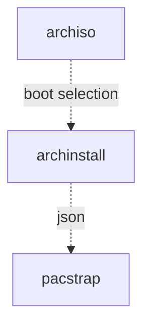

# cozy-salt TODO

<!-- a_cute_template:
- [ ] namespace/repo
  - [ ] feat: description
    - [ ] elaboration on topics
- [ ] orgspace/repo
  - [ ] refactor: description
    - [ ] elaboration on topics
-->

## Seperation of duty

- [ ] vegcom/cozy-salt
  - [x] refactor: config_sls
    - [ ] ensure consistency and seperation of duty in config.sls

## Performance

- [x] vegcom/cozy-salt
  - [x] feat: orch_update
    - [x] provide pkg updates via salt.orch only where possible
    - [x] `pkg.uptodate`, `yay.*upgrade`, `pacman -Su`, `apt.*upgrade`, `dnf.*upgrade`

## Infra

- [ ] vegcom/cozy-salt
  - [ ] refactor: modernize_formula
    - [ ]  `cmd.run.*(wget|curl)` and migrate to `file.managed` + `cmd.run` pattern `srv/salt/linux/k3s.sls` pattern as reference

## Feature

>[!NOTE]
> **WorkInProgress**
>> can't spell progress without pog

### scoping

a plan to make iso great again



>[!NOTE]
> UKI `vegcom/cozy-archiso`

- [ ] vegcom/cozy-archiso
  - [ ] feat: cozy_prov_managed  <!-- low priority: worth mulling over -->
    - [ ] `{"name":"cozy-prov",,"uid":False,"gid":False,"home":"/var/lib/cozy-prov","shell":"/bin/false"}`
  - [ ] feat: tiny_base
    - [ ] container should copy minimal template base
    - [ ] path: `/usr/share/archiso/configs/minimal/`, docs: `/usr/share/doc/archiso/README.profile.rst`
  - [ ] chore: overlay_files
    - [ ] overlay our fs changes
    - [ ] leverage this step to overlay secrets such as user cozy-prov
  - [ ] feat: build_args
    - [ ] container should use arguments not file-override to manage the build arguments
  - [ ] feat: kernel_uki
    - [ ] provide pacman hooks
    - [ ] `path:/etc/mkinitcpio.d/*.preset`
  - [ ] chore: wire_build
    - [ ] container should follow remaining build steps
  - [ ] feat: live_usb:
    - [ ] `packages.x86_64` should tailscal, ser2net, a network driver support
  - [ ] feat: auto_install:
    - [ ] `archinstall` `pacstrap`
- [ ] vegcom/cozy-salt
  - [ ] feat: track_cozy_archiso
    - [ ] gate behind presence`__MANAGE_COZY_PROV_MARKER`
    - [ ] gate behind value `__MANAGE_COZY_PROV_MARKER=(0|1|2)`
  - [ ] refactor: bootstrap_structure.  <!-- med priority: rel to kernel_macro -->
    - [ ] source root at `srv/salt/common/`
    - [ ] futureproof tree `srv/salt/{windows,linux,common}/bootstrap.sls`
    - [ ] gate by kernel (e.g. linux nt) on `srv/salt/{windows,linux}/`
      - [ ] chore: kernel_macro <!-- low priority -->
  - [ ] feat: manage_disabled
    - [ ] salt can `srv/pillar/secrets/disabled_users.sls` hold merge safe `users:cozy-prov:disabled=True`
    - [ ] salt can `srv/salt/orch/` to disable disabled users
    - [ ] iso can disable user afterwards
  - [ ] pref: wrappers
    - [ ] brew, and conda could both benefit
      - [ ] identify means to
  - [ ] pref: alacritty_config
    - [ ] provides per user config
  - [ ] fix: arch_audit_managed_repos
    - [x] add "ownstuff" repo
  - [ ] feat: amd_gpu <!-- med priority -->
  - [ ] pref: steam_native <!-- low priority rel to amd_gpu -->
  - [ ] pref: gamescope <!-- low priority rel to amd_gpu -->
  - [ ] feat: makepkg_sys: `/etc/makepkg.conf`
    - [ ] `s/(-(mtune|march)=[^- ]+){2})/-march=native/`
  - [ ] feat: makepkg_usr  <!-- low priority rel to makepkg_sys -->
    - [ ] `$XDG_CONFIG_HOME/pacman/makepkg.conf` or `~/.makepkg.conf`
    - [ ] `users:{{ user }}:gpg_sign` and `users:{{ user }}:gpg_priv` for cozy-salt-svc
    - [ ] signing: can we use same key as? provisioning/common/dotfiles/.gitconfig

### build_dev

- [ ] preperation

```shell
# ✦ dist_build: adding distcc and sccache
yay -S --noconfirm distcc ccache sccache base-devel
```

- [ ] replication

```shell
# ✦ makepkg_sys: unified builder
PACMAN_AUTH=('sudo' '-u' 'cozy-salt-svc' 'bash' '-li' '-c' '"sudo %c"')
```
  
```shell
# ✦ makepkg_sys: distribute builds
BUILDENV=(distcc color ccache check !sign)
```

```shell
# ✦ makepkg_sys: cflags
CFLAGS="-march=native"
```

```shell
# ✦ makepkg_sys: staticlibs zipman debug 
OPTIONS=(!strip docs libtool staticlibs emptydirs zipman !purge debug lto !autodeps)
```

```shell
# ✦ makepkg_sys: provide distcc config/usage gate similar to k3s selection
DISTCC_HOSTS="localhost/9 10.0.0.0/16 100.64.0.0/10"
```

>[!NOTE]
>
> User in `srv/salt/linux/archlinux`

```yaml | jinja
# ✦ makepkg_user: builddir
BUILDDIR={{user_home}}/scratch/ccache
```

```yaml | jinja
# ✦ makepkg_usr: keys via salt/pillar
GPGKEY="abc_123"
```

### mkinitcpio - config

```shell
# ✦ kernel_uki: kernel integration in our setup
ALL_config="/etc/mkinitcpio.conf"
ALL_kver="/boot/vmlinuz-linux"
ALL_kerneldest="/boot/vmlinuz-linux"
PRESETS=('default')
default_uki="/boot/EFI/Linux/arch-linux.efi"
default_options="--splash /usr/share/systemd/bootctl/splash-arch.bmp"
```

### steamdeck - kernel

- [ ] preperation
  
```shell
# ✦ amd_gpu: blood for the blood god
yay -Qq|grep -Ei 'amdvlk|amdgpu'|xargs yay -R --noconfirm 
```

- [ ] replication

```shell
# ✦ amd_gpu: water for the new king
yay -S --noconfirm lib32-vulkan-radeon vulkan-radeon 
```

### steamdeck - gamescope

- [ ] preperation
  - [ ] repo present
  - [ ] pkg present
  - [ ] CAP_SYS_NICE

```toml
# ✦ arch_audit_managed_repos: steam native runtimes 👍
[ownstuff]
Server = https://ftp.f3l.de/~martchus/$repo/os/$arch
SigLevel = Never
```

- [ ] replication

```shell
# ✦ steam_native: nonbundled libs
yay -S --noconfirm steam-native-runtime gamescope lib32-gamescope-plus
```

```shell
# ✦ gamescope: re-nice
setcap 'CAP_SYS_NICE=eip' $(which gamescope)
```

### wrappers

to not care about perms, respect perms

```shell
# ✦ wrappers: brew
sudo cozy-salt-svc bash -lic 'brew $@'
```

### steam - launch options

```shell
# ✦ wip steam_launch_options: new features
env STEAM_RUNTIME=0
 /usr/bin/steam
 -tenfoot 
 -fulldesktopres
 -gamepadui
 -dev
 -nointro
 -compat-force-slr off
 %U
```

```shell
# ✦ wip game_launch_options: scb wrapper from bazzite
env LD_PRELOAD="$LD_PRELOAD" GLFW_IM_MODULE="ibus"
 sbc --
 %command%
```

### resources

- <https://wiki.archlinux.org/title/Archiso> <!-- archiso -->
  - <https://gitlab.archlinux.org/archlinux/archiso>
- <https://wiki.archlinux.org/title/Archinstall> <!-- archinstall -->
  - <https://archinstall.archlinux.page/>
  - <https://gitlab.archlinux.org/archlinux/arch-install-scripts>
- <https://wiki.archlinux.org/title/Pacstrap> <!-- pacstrap -->
  - <https://man.archlinux.org/man/pacstrap.8>
- <https://wiki.archlinux.org/title/Distcc> <!-- distcc -->
  - <https://man.archlinux.org/man/distccd.1>
  - <https://wiki.archlinux.org/title/Distcc>
- <https://wiki.archlinux.org/title/Pacman> <!-- pacman -->
  - <https://man.archlinux.org/man/pacman.conf.5.en>
  - <https://man.archlinux.org/man/alpm-hooks.5.en>
- <https://wiki.archlinux.org/title/Mkinitcpio>
  - <https://wiki.archlinux.org/title/Mkinitcpio/Minimal_initramfs>
- <https://wiki.archlinux.org/title/Gamescope>
  - <https://github.com/ValveSoftware/gamescope/issues/107>
  - <https://www.reddit.com/r/linux_gaming/comments/15s4yz0/gamescope_fails_to_start_with_vulkan_error/>
  - <https://wiki.archlinux.org/title/Steam/Troubleshooting#Steam_runtime>

## Mess

- [x] salt gate pillar secrets loads
  - [x] /home/vegcom/git/cozy-salt/srv/pillar/secrets/init.sls
- [x] gw get tcpdups
  - [x] to
  - [x] from
- [x] udev rules
  - <https://www.irongeek.com/i.php?page=security/plug-and-prey-malicious-usb-devices#3.2_Locking_down_Linux_using_UDEV>
- [ ] iptables rules
- [x] docker `daemon.json`
  - [x] pillar - config_paths:docker
  - [ ] state - srv/salt/linux/docker.sls
- [x] headscale
  - [x] /home/vegcom/git/cozy-headscale/make/headscale.mk -- refactor and make warmer
  - [x] /home/vegcom/git/cozy-salt/srv/pillar/secrets/headscale.sls --  post wipe
- [ ] k3s/docker class pillar not merging via recurse strategy
  - [ ] use slsutil.renderer + slsutil.merge in state instead of pillar merge
  - [ ] same pattern as docker daemon.json jq merge approach
- [x] pillar unified loader
  - [x] single SLS to replace dynamic top.sls sections (secrets, classes, host, hardware)
  - [x] one file to edit when adding new dynamic pillar sources
- [x] pillar merge strategy: recurse broken across matchers in salt 3008.0rc2
  - https://github.com/saltstack/salt/issues/68785
  - https://github.com/saltstack/salt/issues/59443
  - [ ] ~replace with explicit slsutil.renderer + slsutil.merge in loader~
  - [ ] ~load sources in explicit order, merge same keys manually~
  - [ ] remove pillar_source_merging_strategy: recurse from pillar.conf once done
